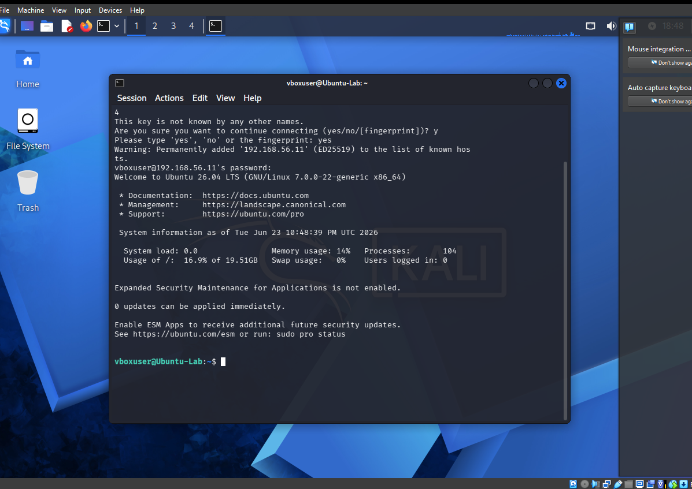
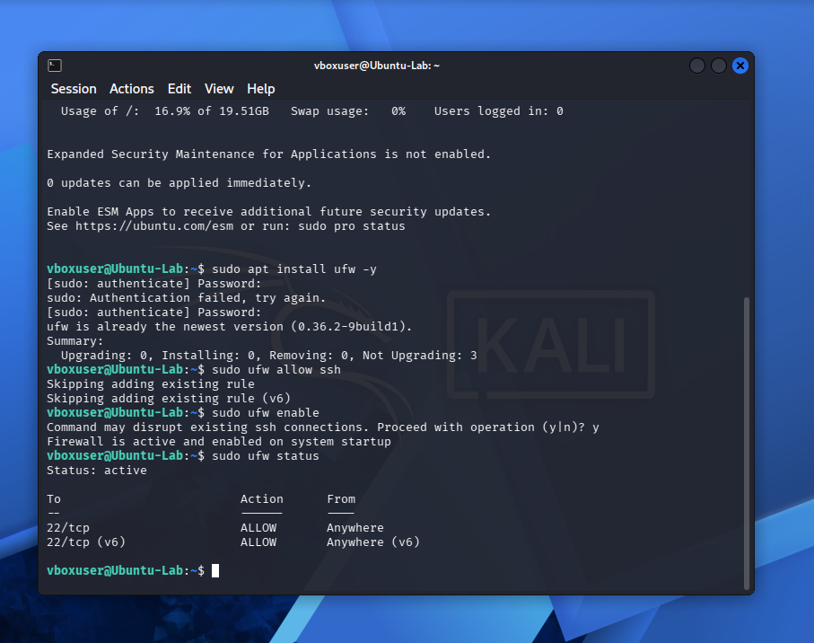
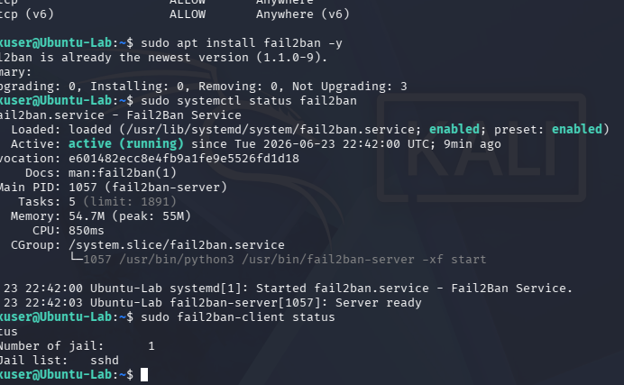

# Linux Server Hardening Lab

A controlled virtual laboratory demonstrating baseline Linux server security and remote administration using OpenSSH, UFW and Fail2Ban.

## Environment

- Ubuntu Server virtual machine: `192.168.56.11`
- Kali Linux virtual machine used as the remote administration client
- Oracle VirtualBox internal network

## Activities Completed

1. Installed OpenSSH Server on Ubuntu Server.
2. Established and verified a remote SSH session from Kali Linux.
3. Installed and enabled UFW.
4. Allowed SSH traffic on port `22/tcp` for IPv4 and IPv6.
5. Installed Fail2Ban and verified that the service was active.
6. Checked Fail2Ban status and confirmed one active jail: `sshd`.

## Evidence

### Verified Remote SSH Access



### Active UFW Rules



### Active Fail2Ban Service and sshd Jail



## Commands Used

```bash
ip a
sudo apt install openssh-server
sudo systemctl status ssh
ssh vboxuser@192.168.56.11
sudo apt install ufw -y
sudo ufw allow ssh
sudo ufw enable
sudo ufw status
sudo apt install fail2ban -y
sudo systemctl status fail2ban
sudo fail2ban-client status
```

## Tools and Technologies

- Ubuntu Server
- Kali Linux
- OpenSSH
- UFW
- Fail2Ban
- VirtualBox
- Linux command line

## Skills Demonstrated

- Remote Linux administration
- Package installation
- Service inspection
- Firewall configuration
- Basic intrusion-prevention setup
- Security verification
- Technical documentation

## Scope

This project demonstrates baseline security controls in a learning environment. It is not presented as a complete production hardening standard, penetration test or proof of resistance against every attack.
